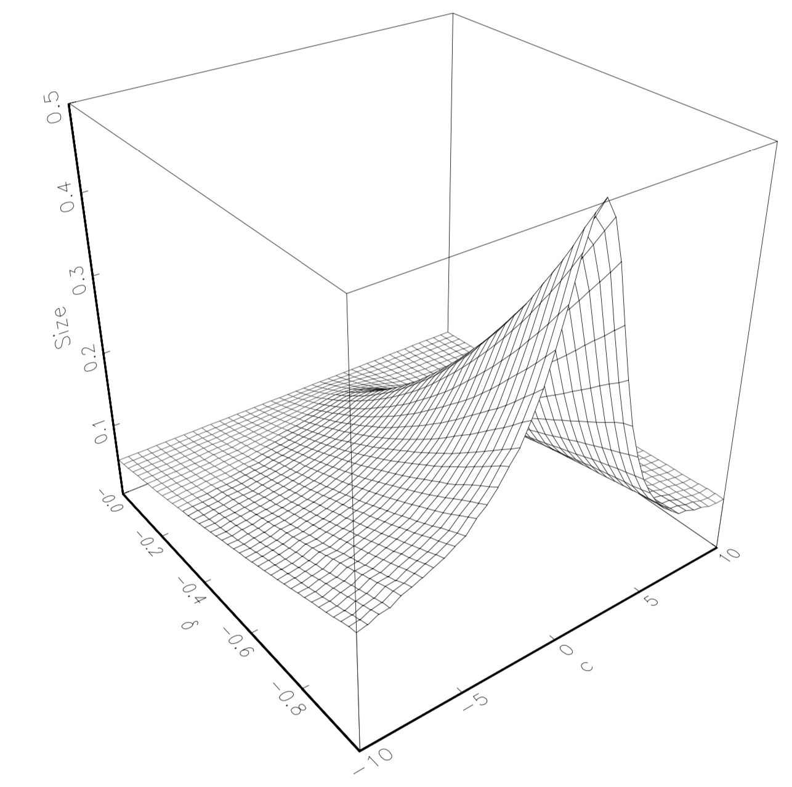
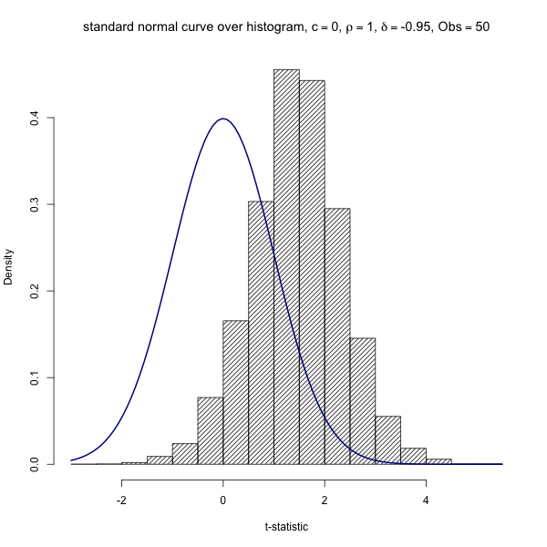
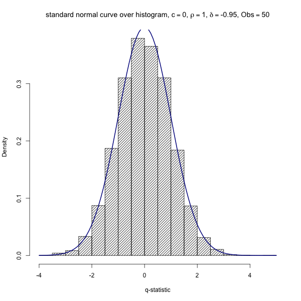
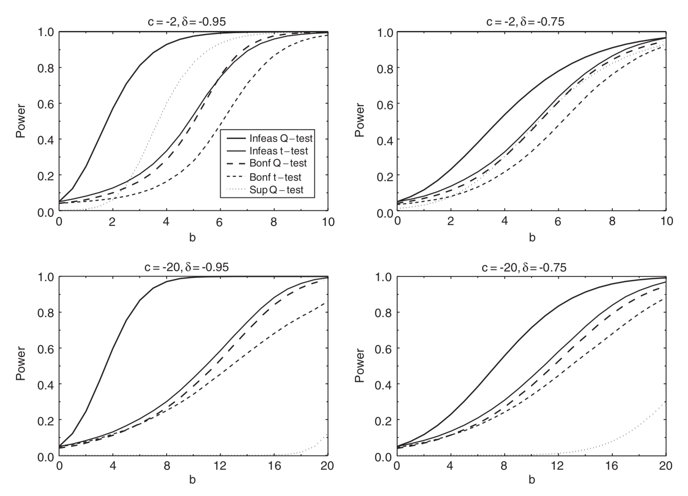
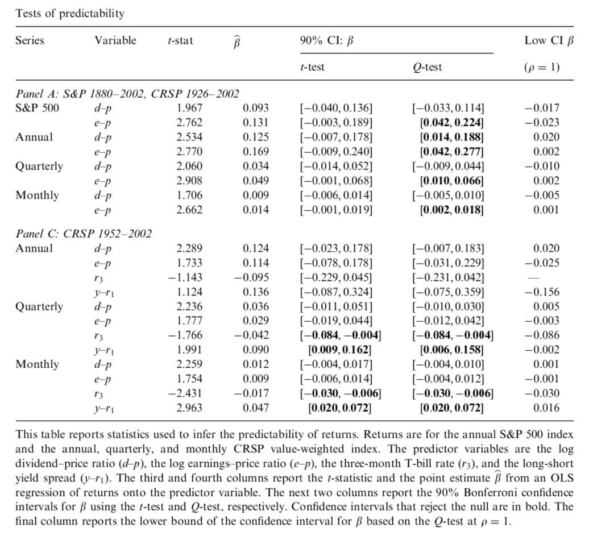

---
title: "Predictive Regressions with Persistent Regressors"
author: "Jan Philipp Wöltjen"
date: June 25, 2019
theme: Copenhagen
colortheme: seahorse
fontsize: 9pt

---

# Outline

+ The regression problem
+ Local to unity asymptotics
+ Constructing a pretest
+ Motivating more efficient tests
+ Constructing the test statistic
+ Making the test feasible
+ Analysis of the power gain
+ Empirical results

# The Regression Setup
- Campbell and Yogo (2006)^[Campbell, J. Y. and M. Yogo (2006). Efficient tests of stock return predictability. Journal of Financial Economics 81, 27-60.] (CY) consider the system of equations:
- \begin{align} 
r_{t} = \alpha + \beta x_{t-1} + u_{t} \\ 
x_{t} = \gamma + \rho  x_{t-1} + e_{t}
\end{align}

- For the sake of simplicity they further assume normality: 
$$\begin{array}{l}{w_{t}=\left(u_{t}, e_{t}\right)^{\prime} \sim \mathrm{N}(0, \Sigma), \text { where $\Sigma$ is known}} \\ {\qquad \Sigma=\left[\begin{array}{cc}{\sigma_{u}^{2}} & {\sigma_{u e}} \\ {\sigma_{\text {ue}}} & {\sigma_{e}^{2}}\end{array}\right]}\end{array}$$

# Testing for Significance
- To test $\beta$ for significance, CY start by considering the maximum likelihood ratio test.

$$\max _{\beta, \rho, \alpha, \gamma} L(\beta, \rho, \alpha, \gamma)-\max _{\rho, \alpha, \gamma} L\left(\beta_{0}, \rho, \alpha, \gamma\right)=t\left(\beta_{0}\right)^{2}>C, $$

- where $C$ is some constant and the joint log likelihood (ignoring two constants) is given by

\begin{equation}
\begin{aligned} L(\beta, \rho, \alpha, \gamma)=&-\frac{1}{1-\delta^{2}} \sum_{t=1}^{T}\left[\frac{\left(r_{t}-\alpha-\beta x_{t-1}\right)^{2}}{\sigma_{u}^{2}}\right.\\ &-2 \delta \frac{\left(r_{t}-\alpha-\beta x_{t-1}\right)\left(x_{t}-\gamma-\rho x_{t-1}\right)}{\sigma_{u} \sigma_{e}} \\ &+\frac{\left(x_{t}-\gamma-\rho x_{t-1}\right)^{2}}{\sigma_{e}^{2}} ] \end{aligned}
\end{equation}

# The T-Test Ignores Information
- The LRT from above turns out to be the same when considering only the marginal likelihood \begin{equation}
L(\beta, \alpha)=-\sum_{t=1}^{T}\left(r_{t}-\alpha-\beta x_{t-1}\right)^{2}
\end{equation}.
- It thus ignores information contained in the system.

# Local to Unity Asymptotics

- The largest autoregressive root is modeled as $\rho=1+c / T$ where c is a fixed constant.
- This does not imply that $\rho$ literally follows this process in practice. It is merely a tool to model autoregressive roots very close to one. It has some nice properties:

- Asymptotic distribution theory is not discontinuous when $x_t$ is $I(1)$.

# Pretesting for Size Distortions of the T-Test
 - Under local-to-unity asymptotic theory the t-statistic does not converge to a standard normal distribution under the null but to functionals of a diffusion process.
 - Under the null it convergences to:

 \begin{equation}
t\left(\beta_{0}\right) \Rightarrow \delta \frac{\tau_{c}}{\kappa_{c}}+\left(1-\delta^{2}\right)^{1 / 2} Z,
\end{equation}

- where $$
\begin{split}
\kappa_{c}=\left(\int J_{c}^{\mu}(s)^{2} d s\right)^{1 / 2}, \tau_{c}=\int J_{c}^{\mu}(s) d W_{e}(s), \\
\text { and } Z \sim \mathrm{N}(0, 1) \text { independent of } \left(W_{e}(s), J_{c}(s)\right)
\end{split}
$$
- $\left(W_{u}(s), W_{e}(s)\right)^{\prime}$ is a two-dimensional Wiener process with correlation $\delta$.

- $J_{c}(s)$ solving  $\mathrm{d} J_{c}(s)=c J_{c}(s) \mathrm{d} s+\mathrm{d} W_{e}(s)$ with initial condition $J_{c}(0)=0$.

- $J_{c}^{\mu}(s)=J_{c}(s)-\int J_{c}(r) \mathrm{d} r$

# Pretesting for Size Distortions of the T-Test (Cont.)
- If $\delta = 0$ the first term of (3) vanishes and the distribution under the null is the usual $\mathrm{N}(0, 1)$.
- Likewise if $c <<0$, $x$ is not persistent and first-order asymptotics are valid.

{ width=50% }

# Pretesting for Size Distortions of the T-Test (Cont.)
- CY propose that we may accept an actual size below 0.075. 
- Test against the null of actual size greater than 0.075.
- Estimate $\delta$ from residuals of (1) and (2).
- Construct confidence interval for c by computing Dickey-Fuller generalized least squares (DF-GLS) test statistic^[For a detailed description of the DF-GLS statistic see the appendix] and using its known distribution under
the alternative to construct the confidence interval for c.
- Reject the null if the confidence interval for c lies strictly below
(or above) the region of the parameter space $(c_{min},c_{max})$.
- Implemented in R package{pr}.

# Developing a More Efficient Test 
+ To improve confidence of inference, we need to increase the signal-to-noise ratio. Here, we focus on reducing the noise. 
+ Since the innovations of (1) and (2) are correlated, CY propose to subtract off this part of the innovations. 
+ In contrast to the t-test, this procedure takes advantage of all the information contained in the system. 

- Assume for the following $\alpha = \gamma = 0$ and $\rho$ is known.

# The Q-test

- Recall the joint log likelihood:
$$\begin{aligned} L(\beta, \rho, \alpha, \gamma)=&-\frac{1}{1-\delta^{2}} \sum_{t=1}^{T}\left[\frac{\left(r_{t}-\alpha-\beta x_{t-1}\right)^{2}}{\sigma_{u}^{2}}\right.\\ &-2 \delta \frac{\left(r_{t}-\alpha-\beta x_{t-1}\right)\left(x_{t}-\gamma-\rho x_{t-1}\right)}{\sigma_{u} \sigma_{e}} \\ &+\frac{\left(x_{t}-\gamma-\rho x_{t-1}\right)^{2}}{\sigma_{e}^{2}} ] \end{aligned}$$

- By the Neyman–Pearson Lemma the most powerful test against the simple alternative (i.e., a alternative that uniquely specifies the distribution) $\beta = \beta_1$ rejects the null if the LR is greater than some constant:
\begin{equation}
\begin{aligned} \sigma_{u}^{2}\left(1-\delta^{2}\right)\left(L\left(\beta_{1}\right)-L\left(\beta_{0}\right)\right)=& 2\left(\beta_{1}-\beta_{0}\right) \sum_{t=1}^{T} x_{t-1}\left[r_{t}-\beta_{u e}\left(x_{t}-\rho x_{t-1}\right)\right] \\ &-\left(\beta_{1}^{2}-\beta_{0}^{2}\right) \sum_{t=1}^{T} x_{t-1}^{2}>C \end{aligned}
\end{equation}
- Where $\beta_{u e}=\sigma_{u e} / \sigma_{e}^{2}$

# The Q-test

- Observe that $\sum_{i=1}^{T} x_{t-1}^{2}$ does not depend on $\beta$.
- CY condition the test on that statistic in order to reduce it to

\begin{equation}
\sum_{t=1}^{T} x_{t-1}\left[r_{t}-\beta_{u e}\left(x_{t}-\rho x_{t-1}\right)\right]>C
\end{equation}

- To get a standard normal distribution under the null they recenter and rescale:
\begin{equation}
\frac{\sum_{t=1}^{T} x_{t-1}\left[r_{t}-\beta_{0} x_{t-1}-\beta_{u e}\left(x_{t}-\rho x_{t-1}\right)\right]}{\sigma_{u}\left(1-\delta^{2}\right)^{1 / 2}\left(\sum_{t=1}^{T} x_{t-1}^{2}\right)^{1 / 2}}>C
\end{equation}

- Finally, after CY de-mean $x_{t-1}$ and denote it by $x_{t-1}^{\mu}$ they can eliminate the assumption $\alpha = \gamma = 0$ to get:

\begin{equation}
Q\left(\beta_{0}, \rho\right)=\frac{\sum_{t=1}^{T} x_{t-1}^{\mu}\left[r_{t}-\beta_{0} x_{t-1}-\beta_{u e}\left(x_{t}-\rho x_{t-1}\right)\right]}{\sigma_{u}\left(1-\delta^{2}\right)^{1 / 2}\left(\sum_{t=1}^{T} x_{t-1}^{\mu 2}\right)^{1 / 2}}
\end{equation}

# Intuition for Q-test

- Consider the case $\beta_0 = 0$.

- Then $$Q\left(\beta_{0}, \rho\right)=\frac{\sum_{t=1}^{T} x_{t-1}^{\mu}\left[r_{t}-\beta_{0} x_{t-1}-\beta_{u e}\left(x_{t}-\rho x_{t-1}\right)\right]}{\sigma_{u}\left(1-\delta^{2}\right)^{1 / 2}\left(\sum_{t=1}^{T} x_{t-1}^{\mu 2}\right)^{1 / 2}}$$ is the t-statistic of the coefficient b regressing $$r_{t}-\beta_{u e}\left(x_{t}-\rho x_{t-1}\right) = a + bx_{t-1} +v_t$$

- $x_{t}-\rho x_{t-1} = e_{t}+\gamma$

- $\beta_{u e}=\sigma_{u e} / \sigma_{e}^{2}$ tells us something about the relation between shocks of (1) and (2).

- The equation above can be interpreted as regressing the de-noised returns onto the regressor x where we exploit the information contained in $\rho$ and the correlation of the shocks. 

# Making the Test Feasible

{ width=45% } { width=45% }

+ If $\rho$ and $\delta$ are known, this Q-test is the best we can do. It's UMP. 
+ In practice, however, $\rho$ and $\delta$ are not known. 
+ $\rho$ cannot be estimated consistently.
+ CY use Bonferroni's inequality to get confidence intervals.

# Bonferroni Confidence Intervals
- Construct a $(1-\alpha_1)$ confidence interval for $\rho$:  $C_{\rho}\left(\alpha_{1}\right)$
- For each value of $\rho$ in the confidence interval, construct a $(1-\alpha_2)$ confidence interval for $\beta$ given $\rho$: $C_{\beta | \rho}\left(\alpha_{2}\right)$
- Taking the union over all $\rho \in C_{\rho}\left(\alpha_{1}\right)$ we can marginalize $\rho$:
\begin{equation}
C_{\beta}(\alpha)=\bigcup_{\rho \in C_{\rho}\left(\alpha_{1}\right)} C_{\beta | \rho}\left(\alpha_{2}\right)
\end{equation}

- with $\alpha = \alpha_1 + \alpha_2$,  $C_{\beta}(\alpha)$ has coverage of at least $(1-\alpha)$
- This follows from Bonferroni's inequality:
$$P\left(\bigcup_{i=1}^{n} E_{i}\right) \leq \sum_{i=1}^{n} P\left(E_{i}\right)$$
where $P\left(E_{i}\right)$ is the probability that $E_{i}$ is true and $P\left(\bigcup_{i=1}^{n} E_{i}\right)$ is the probability that at least one of $E_{1}, E_{2}, \ldots, E_{n}$ is true ^[Weisstein, Eric W. "Bonferroni Inequalities." From MathWorld--A Wolfram Web Resource. http://mathworld.wolfram.com/BonferroniInequalities.html]. 

# Bonferroni Confidence Intervals (Cont.)
- To get the confidence interval for $\rho$, CY need a unit root test statistic.
- Since they suspect $\rho$ in the neighborhood of 1, the DF-GLS test statistic^[For a detailed description of the DF-GLS statistic see the appendix] is a good choice.
- To get the confidence interval for $\beta$ they use the Q-test since they know it to be more powerful than the t-test given true $\rho$ by the Neyman–Pearson Lemma. They hope it remains more powerful for other $\rho$ as well. Whether this hope is met will be seen by numerical analysis. 

# Bonferroni Confidence Intervals (Cont.)

$$C_{\beta | \rho}\left(\alpha_{2}\right)=\left[\underline{\beta}\left(\rho, \alpha_{2}\right), \overline{\beta}\left(\rho, \alpha_{2}\right)\right]$$

- where $$\begin{array}{l}{\qquad \beta(\rho)=\frac{\sum_{t=1}^{T} x_{t-1}^{\mu}\left[r_{t}-\beta_{u e}\left(x_{t}-\rho x_{t-1}\right)\right]}{\sum_{t=1}^{T} x_{t-1}^{\mu 2}} )} \\ {\underline{\beta}\left(\rho, \alpha_{2}\right)=\beta(\rho)-z_{\alpha_{2} / 2} \sigma_{u}\left(\frac{1-\delta^{2}}{\sum_{t=1}^{T} x_{t-1}^{\mu 2}}\right)^{1 / 2}} \\ {\overline{\beta}\left(\rho, \alpha_{2}\right)=\beta(\rho)+z_{\alpha_{2} / 2} \sigma_{u}\left(\frac{1-\delta^{2}}{\sum_{t=1}^{T} x_{t-1}^{\mu 2}}\right)^{1 / 2}} \\ {z_{\alpha_{2} / 2} \text { denotes the } 1-\alpha_{2} / 2 \text { quantile of the standard normal distribution. }}\end{array}$$

# Bonferroni Confidence Intervals (Cont.)
- Let $C_{\rho}\left(\alpha_{1}\right)=\left[\underline{\rho}\left(\underline{\alpha}_{1}\right), \overline{\rho}\left(\overline{\alpha}_{1}\right)\right]$ denote the confidence interval for $\rho$,

- where $\underline{\alpha}_{1}=\operatorname{Pr}\left(\rho<\underline{\rho}\left(\underline{\alpha}_{1}\right)\right)$, $\overline{\alpha}_{1}=\operatorname{Pr}\left(\rho>\overline{\rho}\left(\overline{\alpha}_{1}\right)\right)$, and $\alpha_{1}=\underline{\alpha}_{1}+\overline{\alpha}_{1}$.

- Then the Bonferroni confidence interval is:

\begin{equation}
C_{\beta}(\alpha)=\left[\underline{\beta}\left(\overline{\rho}\left(\overline{\alpha}_{1}\right), \alpha_{2}\right), \overline{\beta}\left(\underline{\rho}\left(\underline{\alpha}_{1}\right), \alpha_{2}\right)\right]
\end{equation}

# We Can Do Better
- The Bonferroni confidence interval is likely to be conservative, i.e., $\operatorname{Pr}\left(\beta \notin C_{\beta}(\alpha)\right) \leqslant \alpha_{2}\left(1-\alpha_{1}\right)+\alpha_{1} \leqslant \alpha$ is likely a strict inequality. 

- To see this consider:

\begin{equation}
\begin{aligned} \operatorname{Pr}\left(\beta \notin C_{\beta}(\alpha)\right)=& \operatorname{Pr}\left(\beta \notin C_{\beta}(\alpha) | \rho \in C_{\rho}\left(\alpha_{1}\right)\right) \operatorname{Pr}\left(\rho \in C_{\rho}\left(\alpha_{1}\right)\right) \\ &+\operatorname{Pr}\left(\beta \notin C_{\beta}(\alpha) | \rho \notin C_{\rho}\left(\alpha_{1}\right)\right) \operatorname{Pr}\left(\rho \notin C_{\rho}\left(\alpha_{1}\right)\right) \end{aligned}
\end{equation}

- $\operatorname{Pr}\left(\beta \notin C_{\beta}(\alpha) | \rho \notin C_{\rho}\left(\alpha_{1}\right)\right)$ is unknown. Thus we have to assume the worst case and bound it by one.
- $\operatorname{Pr}\left(\beta \notin C_{\beta}(\alpha) | \rho \in C_{\rho}\left(\alpha_{1}\right)\right) \leq \alpha_{2}$ is strict if $C_{\beta | \rho}\left(\alpha_{2}\right) \text { depends on } \rho$.

- Bonferroni confidence interval is conservative since it is built on worst case scenario and reality is likely less harsh (more conservative the smaller is $\delta$ in absolute value).
- Refine confidence interval for $\rho$ until the confidence interval for $\beta$ is exactly at the desired significance level $\widetilde{\alpha}$.

# Refined Bonferroni Method

- Do this by numerically searching over a grid.

1. fix $\alpha_2$.
2. for each $\rho$, numerically search to find the $\overline{\alpha}_{1}$ s.t. :
- $\operatorname{Pr}\left(\underline{\beta}\left(\overline{\rho}\left(\overline{\alpha}_{1}\right), \alpha_{2}\right)>\beta\right) \leq \widetilde{\alpha} / 2$ holds for all values of c on the grid, 
- and $\operatorname{Pr}\left(\underline{\beta}\left(\overline{\rho}\left(\overline{\alpha}_{1}\right), \alpha_{2}\right)>\beta\right) = \widetilde{\alpha} / 2$ at some point on the grid.
3. repeat 2. for $\underline{\alpha}_{1}$ s.t. $\operatorname{Pr}\left(\overline{\beta}\left(\underline{\rho}\left(\underline{\alpha}_{1}\right), \alpha_{2}\right)<\beta\right) \leq \widetilde{\alpha} / 2$

- $[\underline{\alpha}_{1}, \overline{\alpha}_{1}]$ defines a tighter confidence interval for $\rho$.
- one-sided Bonferroni test^[For a detailed description of how to implement this test using OLS refer to the appendix. Alternatively, read the source code of R package{pr}] has exact size $\widetilde{\alpha} / 2$ for some $c$.
- two-sided Bonferroni test has at most size $\widetilde{\alpha}$ for all $c$.

# Comparing Power
- All tests considered should reject the null in favor of alternatives of the form $\beta=\beta_{0}+b$, where b is some constant, almost surely as $T\to\infty$. 
- More interesting are alternatives of the form $\beta=\beta_{0}+b / T$, where b is again some constant. 

{ width=70% }

# Analysis of the Power Gain
- CY Compare:
1. A Bonferroni test based on the ADF test and the t-test.
2. A Bonferroni test based on the DF-GLS test and the t-test. 
3. A Bonferroni test based on the DF-GLS test and the Q-test.

# Analysis of the Power Gain (Cont.)
## $$c = -2 \text{ and } \delta = -0.95$$

- Pitman efficiency (relative number of observations needed to achieve 50% power) of test 1 relative to test 2 is 1.03. 
- Pitman efficiency of test 2 relative to test 3 is 1.20.  
- Close to no difference in power between the unrefined and refined Bonferroni t-test. 
- Pitman efficiency of the unrefined relative to the refined Bonferroni Q-test is 1.62.

# Analysis of the Power Gain (Cont.)
## $$c = -20 \text{ and } \delta = -0.95$$

- Pitman efficiency of test 1 relative to test 2 is 1.07. 
- Pitman efficiency of test 2 relative to test 3 is 1.03. 
- Pitman efficiency of the unrefined relative to the refined Bonferroni t-test is 1.23.
- Pitman efficiency of the unrefined relative to the refined Bonferroni Q-test is 1.55 .

# Analysis of the Power Gain (Cont.)

- When the regressor is highly persistent, the use of the Q-test rather than the t-test is an important source of power gain for the Bonferroni Q-test.

- Bonferroni refinement is an especially important source of power gain for the Bonferroni Q-test since it tries to exploit information about $\rho$. This makes its confidence interval for $\beta$ given $\rho$ more sensitive to $\rho$. Hence, without the refinement the Bonferroni test is too conservative.

# Finite Sample Rejection Rates (10,000 Monte Carlo runs)

\begin{table}[ht]
\caption{Finite-sample rejection rates for right-tailed tests of predictability at $\alpha$=0.05}
\centering
\begin{tabular}{rrrrrrrr}
  \hline
 & Obs & c & $\rho$ & $\delta$ & T-test & Bonf.Q-test & Q-test \\ 
  \hline
1 & 50 & 0 & 1.000 & -0.95 & 0.4160 & 0.0826 & 0.0483 \\ 
  2 & 50 & 0 & 1.000 & -0.75 & 0.2916 & 0.0837 & 0.0515 \\ 
  3 & 50 & -2 & 0.961 & -0.95 & 0.2714 & 0.0868 & 0.0482 \\ 
  4 & 50 & -2 & 0.961 & -0.75 & 0.2079 & 0.0881 & 0.0532 \\ 
  5 & 50 & -20 & 0.608 & -0.95 & 0.0977 & 0.1206 & 0.0515 \\ 
  6 & 50 & -20 & 0.608 & -0.75 & 0.0840 & 0.1078 & 0.0484 \\ 
  7 & 100 & 0 & 1.000 & -0.95 & 0.4217 & 0.0616 & 0.0480 \\ 
  8 & 100 & 0 & 1.000 & -0.75 & 0.2930 & 0.0616 & 0.0497 \\ 
  9 & 100 & -2 & 0.980 & -0.95 & 0.2698 & 0.0587 & 0.0505 \\ 
  10 & 100 & -2 & 0.980 & -0.75 & 0.2104 & 0.0588 & 0.0489 \\ 
  11 & 100 & -20 & 0.802 & -0.95 & 0.1063 & 0.0622 & 0.0471 \\ 
  12 & 100 & -20 & 0.802 & -0.75 & 0.0874 & 0.0514 & 0.0500 \\ 
  13 & 250 & 0 & 1.000 & -0.95 & 0.4259 & 0.0476 & 0.0483 \\ 
  14 & 250 & 0 & 1.000 & -0.75 & 0.2970 & 0.0506 & 0.0536 \\ 
  15 & 250 & -2 & 0.992 & -0.95 & 0.2866 & 0.0507 & 0.0481 \\ 
  16 & 250 & -2 & 0.992 & -0.75 & 0.2092 & 0.0466 & 0.0492 \\ 
  17 & 250 & -20 & 0.920 & -0.95 & 0.1080 & 0.0406 & 0.0517 \\ 
  18 & 250 & -20 & 0.920 & -0.75 & 0.0944 & 0.0369 & 0.0501 \\ 
   \hline
\end{tabular}
\end{table}

# Replicated and Updated Results

\begin{table}[ht]
\caption{Empirical results \newline
Data was taken from Amit Goyal's Website. Stock returns are the SP 500 index log-returns from 1926 to 2017 from the Center for Research in Security Press (CRSP) minus the rolled over 3-month T-bill rate. ep is the log 10 year moving average earnings/price ratio (1926 to 2017). dp is the log dividend/price ratio (1926 to 2017). tbl is the 3-month T-bill rate (1952 to 2017). tms is the term-spread between long-term government bonds and tbl (1952 to 2017).}

\centering
\begin{tabular}{llrlrrrl}
  \hline
 Prd & Regr & $\hat{\delta}$ &  CI $\hat{\rho}$ &  T-stat & Pt  & $\hat{\beta}$ &  CI $\left(\sigma_{e} / \sigma_{u}\right)\hat{\beta}$ \\
  \hline
Ann & ep & -0.97 & [0.827,0.979] & 2.12 & 0 & 0.114 & [-0.01,0.18] \\ 
  Ann & dp & -0.86 & [0.875,0.986] & 0.97 & 0 & 0.042 & [-0.069,0.107] \\ 
  Ann & tbl & 0.08 & [0.853,0.908] & -0.41 & 1 & -0.279 & [-0.125,0.075] \\ 
  Ann & tms & -0.06 & [0.454,0.575] & 0.96 & 1 & 1.297 & [-0.071,0.275] \\ 
Qua & ep & -0.98 & [0.973,1.002] & 3.16 & 0 & 0.048 & [0.001,0.039] \\ 
  Qua & dp & -0.95 & [0.976,1.002] & 1.82 & 0 & 0.023 & [-0.012,0.026] \\ 
  Qua & tbl & -0.09 & [0.956,0.975] & -0.64 & 1 & -0.099 & [-0.045,0.019] \\ 
  Qua & tms & 0.06 & [0.835,0.864] & 1.44 & 1 & 0.489 & [-0.005,0.104] \\ 
Mon & ep & -0.99 & [0.993,1.002] & 2.40 & 0 & 0.010 & [-0.002,0.009] \\ 
  Mon & dp & -0.98 & [0.993,1.002] & 1.20 & 0 & 0.004 & [-0.005,0.006] \\ 
  Mon & tbl & -0.13 & [0.992,0.997] & -0.91 & 1 & -0.043 & [-0.013,0.003] \\ 
  Mon & tms & 0.04 & [0.958,0.967] & 1.49 & 1 & 0.156 & [-0.001,0.032] \\ 
   \hline
\end{tabular}
\end{table}

# Results Reported by Campbell and Yogo (2006)

{ width=80% }

# OOS results
\begin{table}[ht]
\caption{Empirical results OOS from 2003 to 2017.}
\centering
\begin{tabular}{llrlrrrl}
  \hline
 Prd & Regr & $\hat{\delta}$ &  CI $\hat{\rho}$ &  T-stat & Pt  & $\hat{\beta}$ &  CI $\left(\sigma_{e} / \sigma_{u}\right)\hat{\beta}$ \\
  \hline
Qua & ep & -0.99 & [0.79,1.015] & 1.51 & 0 & 0.102 & [-0.051,0.203] \\ 
  Qua & dp & -0.97 & [0.719,0.966] & 0.56 & 0 & 0.037 & [-0.097,0.198] \\ 
  Qua & tbl & 0.33 & [0.95,0.987] & -0.70 & 1 & -0.430 & [-0.069,0.021] \\ 
  Qua & tms & 0.18 & [0.9,0.949] & 0.20 & 1 & 0.164 & [-0.07,0.097] \\ 
   \hline
\end{tabular}
\end{table}

# R Implementation

- All source code is available at https://github.com/jpwoeltjen/PersistentRegressors
- Includes a R package that implements the methods discussed called pr (build it from source).
- Furthermore refer to the appendix for a mathematical implementation of the tests. 

#  

$$Appendix$$

# DF-GLS
- Seeks power gain by assuming $\rho$ is in the neighborhood of 1.
- Two possible alternative hypotheses: $y_t$ is stationary around
a linear trend or $y_t$ is stationary with no linear time trend.

- Here we assume no linear time trend.

- Generate the following variables:

- $\begin{array}{ll}{\widetilde{y}_{1}=y_{1}} \\ {\widetilde{y}_{t}=y_{t}-\rho_{_{GLS}} y_{t-1},} & {t=2, \ldots, T} \\ {x_{1}=1} \\ {x_{t}=1-\rho_{_{GLS}},} & { t=2, \ldots, T} \\ \rho_{_{GLS}} = 1 - 7/T \quad \end{array}$

- estimate by OLS $\widetilde{y}_{t}=\delta_{0} x_{t}+\epsilon_{t}$
- The OLS estimator $\widehat{\delta}_{0}$ is then used to remove the mean from $y_{t}$ that is, we generate  
$$y^{*}=y_{t}-\widehat{\delta}_{0}$$

# DF-GLS (Cont.)
- perform augmented Dickey–Fuller test on the transformed variable by fitting the OLS
regression:

$$ \Delta y_{t}^{*}=\beta y_{t-1}^{*}+\sum_{j=1}^{k-1} \zeta_{j} \Delta y_{t-j}^{*}+\epsilon_{t}$$

- For AR(1) this reduces to:
$$ \Delta y_{t}^{*}= \beta y_{t-1}^{*} +\epsilon_{t}$$

- The t-statistic of $\beta$ is the DF-GLS test statistic.

- Test the null hypothesis $H_{0} : \beta=0$ by using tabulated critical values. 

# Bonferroni Implementation $[\underline{\rho}, \overline{\rho}]=[1+\underline{c} / T, 1+\overline{c} / T]$

- Run the regression $r_{t}=\alpha+\beta x_{t-1}+u_{t}$ to get $\operatorname{SE}(\widehat{\beta})$.
- Run the regression $x_{t}=\gamma+\rho x_{t-1}+e_{t}$ to get $\operatorname{SE}(\widehat{\rho})$.
- Use the residuals $\widehat{u}_{t}$ and $\widehat{e}_{t}$ to compute:
- $$\begin{aligned} \widehat{\sigma}_{u}^{2} &=\frac{1}{T-2} \sum_{t=1}^{T} \widehat{u}_{t}^{2} \\ \widehat{\sigma}_{e}^{2} &=\frac{1}{T-2} \sum_{t=1}^{T} \hat{e}_{t}^{2} \\ \widehat{\sigma}_{u e} &=\frac{1}{T-2} \sum_{t=1}^{T} \widehat{u}_{t} \widehat{e}_{t} \\ \widehat{\delta} &=\frac{\widehat{\sigma}_{u e}}{\widehat{\sigma}_{u} \widehat{\sigma}_{e}} \end{aligned}$$

# Bonferroni Implementation $[\underline{\rho}, \overline{\rho}]=[1+\underline{c} / T, 1+\overline{c} / T]$ (Cont.)

- Compute the DF-GLS statistic.

- Given DF-GLS statistic and $\widehat{\delta}$ use lookup tables to get $[\underline{c}, \overline{c}]$.^[ Lookup tables are provided by Campbell, J.Y., Yogo, M., 2005. Implementing the econometric methods in ‘‘Efficient tests of stock return
predictability’’. Unpublished working paper. University of Pennsylvania.]

- Now we can compute the confidence interval for $\rho$ which is given by $[\underline{\rho}, \overline{\rho}]=[1+\underline{c} / T, 1+\overline{c} / T]$

# Bonferroni Implementation $[\underline{\beta}(\rho), \overline{\beta}(\rho)]$

- Run the regression $r^{*}_{t}=\alpha+\beta x_{t-1}+u_{t}$ for each $\rho=\{\underline{\rho}, \overline{\rho}\}$ to get $\widehat{\beta}(\rho)$. 
- Where $r^{*}_{t} = r_{t}-\widehat{\sigma}_{u e} \widehat{\sigma}_{e}^{-2}\left(x_{t}-\rho x_{t-1}\right)$. 

- The confidence interval for $\beta$ given $\rho$ is $[\underline{\beta}(\rho), \overline{\beta}(\rho)]$

- Where $$\begin{array}{l}{\underline{\beta}(\rho)=\widehat{\beta}(\rho)-1.645\left(1-\widehat{\delta}^{2}\right)^{1 / 2} \operatorname{SE}(\widehat{\beta})} \\ {\overline{\beta}(\rho)=\widehat{\beta}(\rho)+1.645\left(1-\widehat{\delta}^{2}\right)^{1 / 2} \operatorname{SE}(\widehat{\beta})}\end{array}$$

- The 90% Bonferroni confidence interval $[\underline{\beta}(\overline{\rho}), \overline{\beta}(\underline{\rho})]$ corresponds to a 10% two-sided test or a 5% one-sided test of the null hypothesis $\beta=0$.

# Power of Q-test under Local Alternative
- Under the local alternative \begin{equation}
\begin{aligned} Q\left(\beta_{0}, \widetilde{\rho}\right)=& \frac{b\left(T^{-2} \sum_{t=1}^{T} x_{t-1}^{\mu 2}\right)^{1 / 2}}{\sigma_{u}\left(1-\delta^{2}\right)^{1 / 2}}+\frac{\delta(\widetilde{c}-c)\left(T^{-2} \sum_{t=1}^{T} x_{t-1}^{\mu 2}\right)^{1 / 2}}{\omega\left(1-\delta^{2}\right)^{1 / 2}} \\+& \frac{T^{-1} \sum_{t=1}^{T} x_{t-1}^{\mu}\left(u_{t}-\sigma_{u e} /\left(\sigma_{e} \omega\right) v_{t}\right)+\frac{1}{2} \sigma_{u e} /\left(\sigma_{e} \omega\right)\left(\omega^{2}-\sigma_{v}^{2}\right)}{\sigma_{u}\left(1-\delta^{2}\right)^{1 / 2}\left(T^{-2} \sum_{t=1}^{T} x_{t-1}^{\mu 2}\right)^{1 / 2}} \end{aligned}
\end{equation}

- where $\widetilde{c}=T(\widetilde{\rho}-1)$

\begin{equation}
Q\left(\beta_{0}, \widetilde{\rho}\right) \Rightarrow \frac{b \omega \kappa_{c}}{\sigma_{u}\left(1-\delta^{2}\right)^{1 / 2}}+\frac{\delta(\widetilde{c}-c) \kappa_{c}}{\left(1-\delta^{2}\right)^{1 / 2}}+Z
\end{equation}

# Power of Q-test under Local Alternative (Cont.)

- The power function for a right-tailed test is \begin{equation}
\pi_{Q}(b)=\mathrm{E}\left[\Phi\left(z_{\alpha}-\frac{b \omega \kappa_{c}}{\sigma_{u}\left(1-\delta^{2}\right)^{1 / 2}}-\frac{\delta(\widetilde{c}-c) \kappa_{c}}{\left(1-\delta^{2}\right)^{1 / 2}}\right)\right]
\end{equation}

- Where $\Phi(z)$ is one minus the standard normal CDF, $z_{\alpha}$ is the $1-\alpha$ quantile.
- The expectation is taken over the distribution of $\left(W_{e}(s), J_{c}(s)\right)$.
